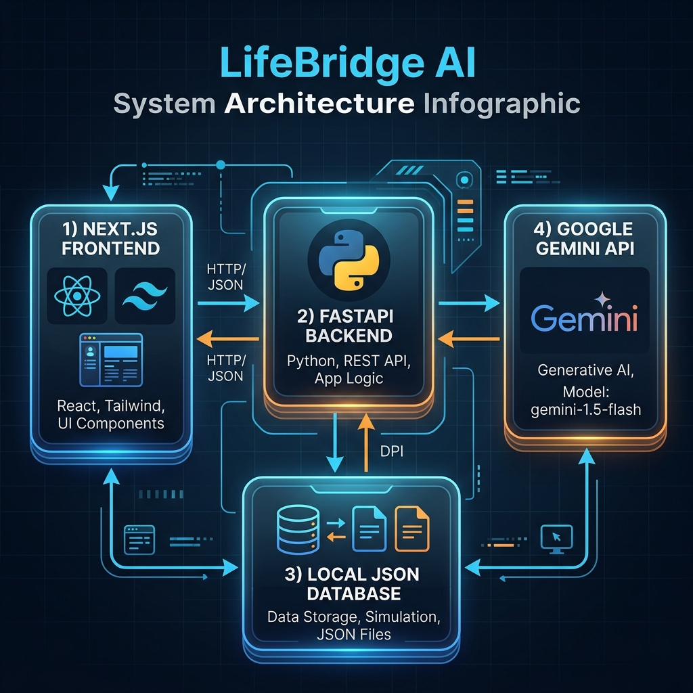
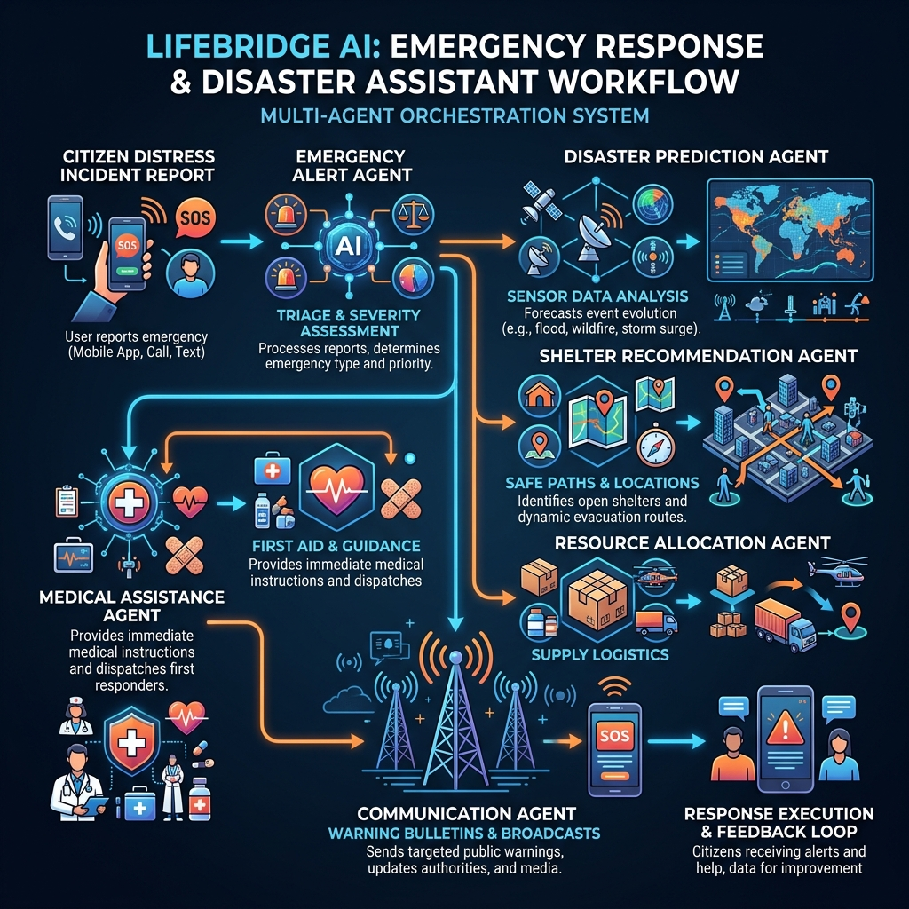

# LifeBridge AI - Emergency Response & Disaster Assistant

LifeBridge AI is an advanced, multi-agent disaster response command platform designed to assist citizens, emergency coordinators, volunteers, and rescue agencies during critical crises such as floods, cyclones, earthquakes, landslides, and fires. 

This platform represents a startup-grade emergency response application optimized for a **Kaggle AI Agents Capstone Project** under the *"Agents for Good"* track.

---

## 🛠️ Tech Stack & Architecture

- **Frontend**: Next.js 15 (React), Tailwind CSS v4, HTML5 Web Speech API (Multilingual TTS/STT).
- **Backend**: FastAPI (Python 3.13 compatible), Pydantic v2.
- **AI Engine**: Google Gemini API (`gemini-1.5-flash`), Google GenAI SDK.
- **Orchestration**: Custom cooperative multi-agent workflow graph.
- **Local Persistence & Fallbacks**: High-fidelity local simulation engines (runs with zero configuration out-of-the-box).

---

## 📐 System Architecture

The platform follows a decoupled client-server architecture designed to run reliably both in online and offline-first contexts:



- **Next.js 15 Frontend**: Renders the responsive dark-themed visual command dashboard, handles HTML5 audio recordings for voice control, tracks user positions, and renders real-time state tracing for the agent workflows.
- **FastAPI Backend**: Orchestrates the multi-agent coordinate pipeline, performs image data parsing for the damage vision agent, and operates the local simulation engine.
- **Google Gemini API (`gemini-1.5-flash`)**: Powers agent reasoning, query classification, medical first-aid triage advice, and risk analysis.
- **Simulation Fallback Engine**: Enables full functionality in isolated offline environments. The backend automatically switches to simulation mode when no Gemini API key is configured, utilizing rule-based heuristics and local JSON seed databases.

---

## 🤖 Cooperative Multi-Agent Workflow

When a citizen files a distress report, the platform initiates a sequential coordination pipeline using 8 specialized AI agents. This workflow is visually represented below:



### The 8-Agent Orchestration Pipeline:
1. **Emergency Alert Agent**: Triages the incident, extracts severity, coordinates, and disaster type.
2. **Disaster Prediction Agent**: Analyzes sensor feeds (rain gauges, wind speeds, water levels) to predict progress and secondary hazards.
3. **Shelter Recommendation Agent**: Pinpoints nearby operating shelter hubs and plots safe evacuation routes.
4. **Medical Assistance Agent**: Performs medical triage on injuries and outputs step-by-step first aid guides.
5. **Resource Allocation Agent**: Dispatches supplies, tracking inventory and alerting regional supply vehicles.
6. **Communication Agent**: Broadcasts critical warnings and auto-generates geo-targeted SMS/bulletins.
7. **News Monitoring Agent**: Synthesizes RSS, weather warnings, and local news bulletins.
8. **Volunteer Coordination Agent**: Automatically matches distress requests with registered volunteers by location and skill.

---

## 🚀 Key Features

1. **Disaster Digital Twin**: Interactive glowing SVG tactical radar map plotting threat vectors, shelter node occupancies, and critical supply metrics.
2. **Visual Agent Pipeline**: Real-time flowchart illustrating the logic trace and execution output of each coordinating agent.
3. **Multilingual Speech chatbot**: Conversational emergency guide supporting text and spoken speech in English, Hindi, Kannada, Tamil, and Telugu.
4. **SOS Distress Generator**: Big-button trigger capturing HTML5 coordinates and outputting a downloadable/shareable rescue card.
5. **Smart Kit Builder**: Custom checklist calculator based on household children, elders, and pets. Exportable to Markdown documents.
6. **Damage Vision Analyzer**: Vision analyzer that processes disaster images, estimates damage severity, and provides safety rules.
7. **Family Safety Log**: Tracker letting family members mark safe/missing status and share regional positions.
8. **Offline Resilience**: LocalStorage backups caching helpline indexes and first-aid manuals for internet outages.

---

## 🏁 Setup & Execution

### 1. Prerequisites
- **Node.js** (v18 or higher) & **npm** installed.
- **Python** (v3.9 to v3.13) & **pip** installed.

---

### 2. Backend Installation & Start
Open a terminal in the root directory:

```bash
# 1. Install dependencies
pip install -r backend/requirements.txt

# 2. Configure environment (Optional)
# If set, LifeBridge utilizes live Gemini API intelligence.
# If omitted, the platform starts in local Simulation Mode automatically.
$env:GEMINI_API_KEY="your-api-key-here"

# 3. Start the FastAPI application
python -m uvicorn backend.main:app --reload --port 8000
```
FastAPI server starts running at `http://127.0.0.1:8000`.

---

### 3. Frontend Installation & Start
Open a separate terminal in the root directory:

```bash
# 1. Navigate to frontend directory
cd frontend

# 2. Install next.js dependencies
npm install

# 3. Launch Next.js dev server
npm run dev
```
Open your browser and navigate to `http://localhost:3000`.

---

## 📊 Verification & Tests
The backend contains automated integration tests verifying database seeding, agent response simulations, and multi-agent workflow chains:

```bash
# Run integration tests
$env:PYTHONPATH="."; python backend/test_api.py
```
Outputs should display passing checks:
```text
Testing Database Load...
[OK] Database Load Verified!
Testing Agent Simulations...
[OK] Agent Simulations Verified!
Testing Multi-Agent Workflow Coordinator...
[OK] Multi-Agent Workflow Coordinator Verified!
All tests completed successfully!
```
