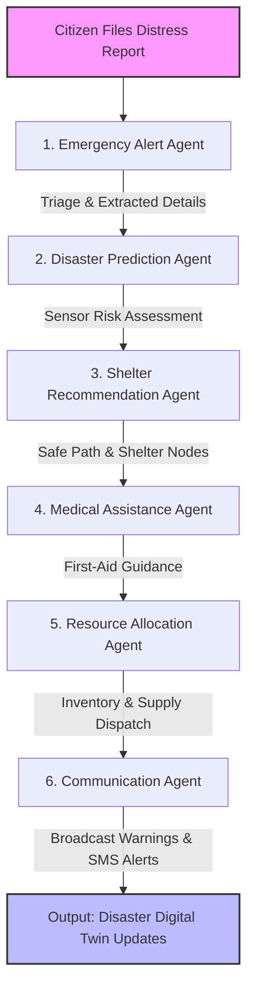

# LifeBridge AI - Project Documentation & Workflow

LifeBridge AI is an advanced, startup-grade emergency response and disaster assistant platform optimized for crisis coordination. It acts as an intelligent command center connecting citizens, emergency coordinators, rescue agencies, and volunteers during critical situations like floods, earthquakes, cyclones, landslides, and fires.

---

## 🗺️ System Flow Diagram

The following diagram illustrates the lifecycle of a citizen's distress incident report as it coordinates through the multi-agent system:

### Mermaid Flow Chart Representation

---

## 🤖 Cooperative Multi-Agent Core

When a citizen triggers an alert, the coordination graph manages the execution of **8 cooperative AI agents** in sequence:

1. **Emergency Alert Agent**: Automatically triages incident type, severity level, extracting geolocation and crucial coordinates.
2. **Disaster Prediction Agent**: Aggregates live sensor metrics (rainfall, wind speeds, water gauges) to determine secondary hazards.
3. **Shelter Recommendation Agent**: Directs users to the closest operational shelter and maps high-elevation evacuation routes.
4. **Medical Assistance Agent**: Provides customized first-aid responses and triage instructions based on reported injuries.
5. **Resource Allocation Agent**: dispatches supply trucks, checking shelter levels and truck dispatch status.
6. **Communication Agent**: Crafts warning bulletins and generates geo-targeted SMS emergency texts.
7. **News Monitoring Agent**: Constantly monitors RSS weather feeds and regional warnings to synthesize summaries.
8. **Volunteer Coordination Agent**: Automatically recruits and matches local volunteers based on skills and proximity.

---

## 🌟 Core Features

* **Disaster Digital Twin**: Interactive glowing SVG tactical radar map plotting threat vectors, shelter node occupancies, and critical supply metrics.
* **Visual Agent Pipeline**: Real-time flowchart illustrating the logic trace and execution output of each coordinating agent.
* **Multilingual Speech Chatbot**: Conversational emergency guide supporting text and spoken speech in English, Hindi, Kannada, Tamil, and Telugu.
* **SOS Distress Generator**: Big-button trigger capturing HTML5 coordinates and outputting a downloadable/shareable rescue card.
* **Smart Kit Builder**: Custom checklist calculator based on household children, elders, and pets. Exportable to Markdown documents.
* **Damage Vision Analyzer**: Vision analyzer that processes disaster images, estimates damage severity, and provides safety rules.
* **Family Safety Log**: Tracker letting family members mark safe/missing status and share regional positions.
* **Offline Resilience**: LocalStorage backups caching helpline indexes and first-aid manuals for internet outages.

---

## 🛠️ Architecture & Tech Stack

* **Frontend**: Next.js 15 (React), Tailwind CSS v4, HTML5 Web Speech API (Multilingual TTS/STT).
* **Backend**: FastAPI (Python 3.13 compatible), Pydantic v2.
* **AI Engine**: Google Gemini API (`gemini-1.5-flash`), Google GenAI SDK.
* **Orchestration**: Custom cooperative multi-agent workflow graph.
* **Local Persistence & Fallbacks**: High-fidelity local simulation engines (runs with zero configuration out-of-the-box).
